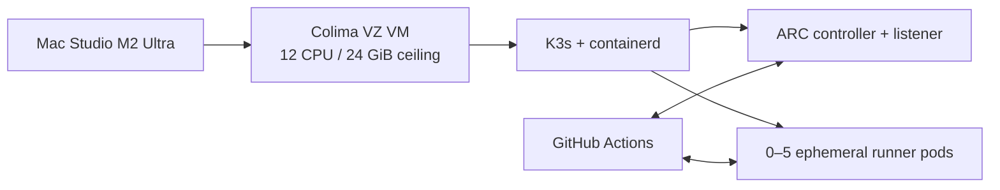

# ARC Self-Hosted Runners

GitHub Actions Runner Controller (ARC) on an Apple Silicon Mac using Colima,
K3s, and containerd.

The default profile is tuned for this Mac Studio:

- Apple Virtualization.framework (`vz`), native ARM64
- 12 virtual CPUs, 24 GiB RAM, 150 GiB sparse container disk
- K3s directly in the Linux VM; no Docker Desktop or nested kind node
- 1 CPU and 2 GiB RAM reserved for K3s and guest system services
- Up to 5 ephemeral runners, each requesting 1.5 CPUs and 2 GiB RAM and
  limited to 2 CPUs and 4 GiB RAM
- GitHub's official runner image plus only `build-essential`

## Quick start

### 1. Install dependencies

```bash
./scripts/install-prerequisites.sh
```

This installs Colima, kubectl, and Helm with Homebrew.

### 2. Start the cluster

```bash
./scripts/create-cluster.sh
```

The command is idempotent. Override the defaults when necessary:

```bash
COLIMA_CPU=12 COLIMA_MEMORY=32 COLIMA_DISK=150 ./scripts/create-cluster.sh
```

The memory value is a VM ceiling, not reliably elastic memory. Apple's VZ
backend commits pages as the guest touches them, but Colima/Lima may retain
those pages until the VM stops. The 24 GiB default limits the host impact while
leaving headroom for this repository's five-job concurrency cap.

Optionally enable login startup after the profile has been created:

```bash
./scripts/install-autostart.sh
```

Optionally install idle memory maintenance. It checks every five minutes and
restarts Colima only when ARC has had no runner pods for 30 minutes and the
ARC VZ process is retaining at least 16 GiB on the host:

```bash
./scripts/test-idle-maintenance.sh
./scripts/install-idle-maintenance.sh
```

The script checks the scale-set status and runner pods twice before restarting,
so queued or active ARC work cancels maintenance. Customize the installed
thresholds when needed:

```bash
ARC_IDLE_MINUTES=45 \
ARC_MEMORY_THRESHOLD_GIB=18 \
ARC_CHECK_INTERVAL_SECONDS=300 \
./scripts/install-idle-maintenance.sh
```

Run a read-only check or follow the service log with:

```bash
./scripts/arc-idle-maintenance.sh --dry-run
tail -f /tmp/arc-idle-maintenance.log
```

Open the local dashboard directly in a browser—no server is required. The
maintenance service refreshes its snapshot every five minutes, and the open
page reloads itself every minute:

```bash
open dashboard/index.html
```

### 3. Configure GitHub App credentials

```bash
cp secret.template.sh secret.sh
chmod +x secret.sh
```

Fill in the App ID, installation ID, and private key. `secret.sh` is ignored by
Git and must never be committed.

### 4. Build the runner image locally

```bash
./scripts/rebuild-runner-image.sh
```

The image is built natively on ARM64 directly in containerd's `k8s.io`
namespace. K3s can therefore start runner pods without a registry pull.

### 5. Deploy ARC

```bash
export GITHUB_CONFIG_URL=https://github.com/BITASIA
./scripts/deploy-arc.sh
```

The default mode runs each job in its ephemeral runner pod. This is the lowest
overhead mode for the current workflows.

Use `arc-runner-set` in workflows:

```yaml
jobs:
  test:
    runs-on: arc-runner-set
    steps:
      - uses: actions/checkout@v7
      - run: echo "Running on ARC"
```

## Runner image

The runner version is pinned in `.runner-version`. The Dockerfile derives from
`ghcr.io/actions/actions-runner` and adds only `build-essential`, which is
required by the repository's native Node dependencies.

Useful commands:

```bash
# Compare the pin with GitHub's latest runner release
./scripts/rebuild-runner-image.sh --check

# Update the pin, build natively, and update the deployed scale set
./scripts/rebuild-runner-image.sh --upgrade

# Pull the pinned image from GHCR instead of building locally
./scripts/rebuild-runner-image.sh --pull-only
```

The weekly workflow at `.github/workflows/rebuild-runner-image.yml` builds
`linux/amd64` and `linux/arm64` and publishes:

```text
ghcr.io/codeyogi911/arc-runner:<runner-version>
ghcr.io/codeyogi911/arc-runner:latest
```

It authenticates to GHCR with the repository's automatic `GITHUB_TOKEN`; no
Docker Hub secrets are required. Make the GHCR package public after its first
publication so a fresh cluster can pull it without an image pull secret.

## Optional Kubernetes job-container mode

For workflows that explicitly declare a `container:` image:

```bash
export GITHUB_CONFIG_URL=https://github.com/BITASIA
export CONTAINER_MODE=kubernetes
./scripts/deploy-arc.sh
```

This creates a separate Kubernetes pod for each job container and uses K3s's
`local-path` storage class for the shared workspace. It has more startup
overhead than default mode. `helm/values-kubernetes-mode.yaml` currently allows
jobs without `container:` for compatibility; GitHub warns that doing so gives
the runner pod elevated Kubernetes API access.

## Operations

```bash
# Cluster and ARC status
./scripts/status.sh

# Active runner pods
kubectl get pods -n arc-runners -w

# Controller logs
kubectl logs -n arc-systems -l app.kubernetes.io/component=controller-manager

# Stop the VM without deleting images or cluster state
colima stop --profile arc

# Start it again
./scripts/create-cluster.sh

# Upgrade ARC charts
export GITHUB_CONFIG_URL=https://github.com/BITASIA
./scripts/upgrade-arc.sh

# Permanently delete the local ARC VM and data
./scripts/teardown.sh
```

## Architecture


```mermaid
flowchart LR
    mac["Mac Studio M2 Ultra"] --> vz["Colima VZ VM<br/>12 CPU / 24 GiB ceiling"]
    vz --> k3s["K3s + containerd"]
    k3s --> controller["ARC controller + listener"]
    k3s --> runners["0–5 ephemeral runner pods"]
    github["GitHub Actions"] <--> controller
    github <--> runners
```

## Troubleshooting

```bash
# Confirm Colima configuration
colima status --profile arc --extended

# Select the correct cluster
kubectl config use-context colima-arc

# Inspect listener registration and scaling decisions
kubectl logs -n arc-systems -l app.kubernetes.io/component=runner-scale-set-listener

# Check runner objects and assigned jobs
kubectl get ephemeralrunners -n arc-runners -o wide

# Confirm the runner image is cached in K3s
colima nerdctl --profile arc -- --namespace k8s.io images
```

## References

- [Actions Runner Controller](https://docs.github.com/en/actions/concepts/runners/actions-runner-controller)
- [ARC runner scale sets](https://docs.github.com/en/actions/how-tos/manage-runners/use-actions-runner-controller/deploy-runner-scale-sets)
- [Colima](https://github.com/abiosoft/colima)
