# ARC Self-Hosted Runners

Self-hosted GitHub Actions runners using Actions Runner Controller (ARC) on Kubernetes.

## Prerequisites

- **Docker Desktop** (or Docker Engine)
- **macOS** with Homebrew (for automated setup) or manual installation on Linux

## Quick Start

### 1. Install Dependencies

```bash
./scripts/install-prerequisites.sh
```

This installs:
- `kubectl` - Kubernetes CLI
- `helm` - Kubernetes package manager
- `kind` - Local Kubernetes cluster

### 2. Create Kubernetes Cluster

```bash
./scripts/create-cluster.sh
```

### 3. Configure GitHub App Secret

Copy the secret template and fill in your GitHub App credentials:

```bash
cp secret.template.sh secret.sh
# Edit secret.sh with your GitHub App credentials
chmod +x secret.sh
```

> ⚠️ **Never commit `secret.sh`** - it contains sensitive credentials!

### 4. Deploy ARC

Set your GitHub organization or repository URL, then deploy:

```bash
export GITHUB_CONFIG_URL=https://github.com/YOUR_ORG
# Or for a specific repo: export GITHUB_CONFIG_URL=https://github.com/YOUR_ORG/YOUR_REPO

./scripts/deploy-arc.sh
```

## Usage

Once deployed, use `arc-runner-set` in your workflows:

```yaml
name: My Workflow
on: [push]

jobs:
  build:
    runs-on: arc-runner-set
    steps:
      - uses: actions/checkout@v4
      - run: echo "Running on self-hosted ARC runner!"
```

## Management Commands

```bash
# Check deployment status
./scripts/status.sh

# View runner pods (when jobs are running)
kubectl get pods -n arc-runners -w

# View logs
kubectl logs -n arc-systems -l app.kubernetes.io/component=controller-manager

# Upgrade ARC to latest version
export GITHUB_CONFIG_URL=https://github.com/YOUR_ORG
./scripts/upgrade-arc.sh

# Teardown everything
./scripts/teardown.sh
```

## Architecture

```mermaid
flowchart TB
    subgraph cluster["☸️ kind cluster"]
        subgraph arc-systems["arc-systems namespace"]
            controller["🎮 Controller"]
            listener["👂 Listener"]
        end
        
        subgraph arc-runners["arc-runners namespace"]
            runner1["🏃 Runner Pod"]
            runner2["🏃 Runner Pod"]
            runner3["🏃 ..."]
        end
    end
    
    github["🐙 GitHub API\n(your org/repo)"]
    
    listener <-->|"polls for jobs"| github
    controller -->|"scales"| arc-runners
    github -->|"workflow triggered"| listener
    listener -->|"creates runners"| controller
```



## Customization

### Runner Scale Set Configuration

Edit `helm/values.yaml` to customize your runners. This is the official ARC values template with all available options documented.

Common configurations:
- `minRunners` / `maxRunners` - Autoscaling limits
- `containerMode.type` - Set to `dind` for Docker-in-Docker support
- `template.spec` - Full PodSpec for runner pods (resources, volumes, etc.)

Example - enable Docker-in-Docker:
```yaml
containerMode:
  type: "dind"
```

Example - set runner limits:
```yaml
minRunners: 1
maxRunners: 10
```

### Controller Configuration

Edit `helm/controller-values.yaml` to customize controller settings.

## Troubleshooting

### Docker not running
```bash
open -a Docker  # macOS
# Wait for Docker to start, then retry
```

### Cluster connection issues
```bash
kind get clusters
kubectl config use-context kind-arc-cluster
```

### Runner not picking up jobs
```bash
# Check listener logs
kubectl logs -n arc-systems -l app.kubernetes.io/component=listener

# Verify GitHub App permissions
# Ensure app has: Administration (Read & Write), Self-hosted runners (Read & Write)
```

## GitHub App Setup

If you need to create a new GitHub App:

1. Go to **Organization Settings** → **Developer settings** → **GitHub Apps**
2. Create new GitHub App with these permissions:
   - **Repository permissions**: Administration (Read & Write)
   - **Organization permissions**: Self-hosted runners (Read & Write)
3. Generate a private key
4. Install the app on your organization
5. Note the App ID and Installation ID

## References

- [ARC Quickstart](https://docs.github.com/en/actions/tutorials/use-actions-runner-controller/quickstart)
- [ARC Authentication](https://docs.github.com/en/actions/tutorials/use-actions-runner-controller/authenticate-to-the-api)
- [kind Documentation](https://kind.sigs.k8s.io/)

